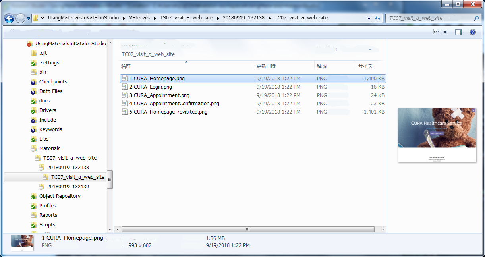
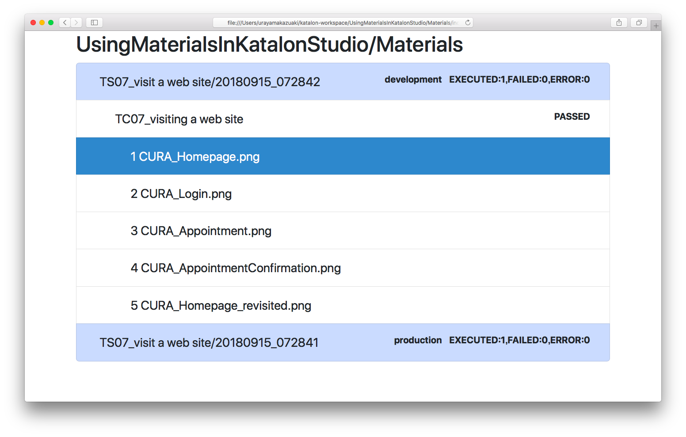
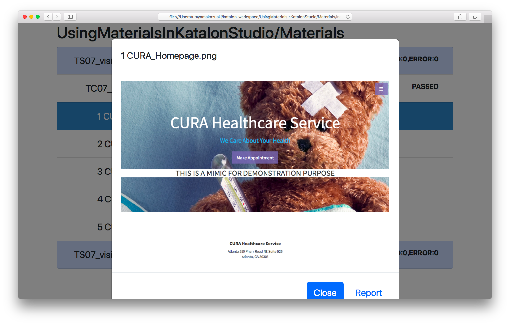

Using Materials in Katalon Studio
=====================================

# What is this repository?

This is a [Katalon Studio](https://www.katalon.com/) project for demonstration purpose. You can clone this out to your PC and run it with your Katalon Studio.

I have developed another project on GitHub named ['Materials'](https://github.com/kazurayam/Materials). The project is developed in Groovy language, provides a jar file. You can download Materials-x.x.x.jar file from the [Release](https://github.com/kazurayam/Materials/releases) page. The jar is supposed to be imported into Katalon Studio projects as an [External library](https://docs.katalon.com/display/KD/External+Libraries).

In this 'UsingMaterialsInKatalonStudio' project, I will show you, step by step, how to write test scripts in Katalon Studio making use of the ['Materials'](https://github.com/kazurayam/Materials) library.

The Groovydoc of the `Materials` is published [here](https://kazurayam.github.io/Materials/).

This project was initially developed using Katalon Studio 5.7.0 and tested using most of the versions up to Katalon Studio 6.3.2. In fact, the Materials library is NOT dependent on Katalon Studio API at all.

# Problem to solve

What is a *material*? By the term *Material* I mean any file created by test scripts on the fly. A typical example of a *Material* is a PNG file as screenshot of web page taken by [WebDriver API](https://seleniumhq.github.io/selenium/docs/api/java/org/openqa/selenium/TakesScreenshot.html). Other examples of *Material* would include:
1. PDF files downloaded from web site
2. Excel/CSV files created by test script
3. JSON/XML responses from RESTful API call
4. HTTP Response Header in plain \*.txt format

Selenium WebDriver and Katalon Studio provide sound support for interacting with web. But their support falls short of the following problem: **which path to save a file as?**

Specifying a one-off path is trivial. Say, `C:\Users\myname\tmp\sample_screenshot.png` would be fine. However if we are to make dozens of *materials* repeatedly and **if we are to reuse the files after interating with web**, then it becomes an itchy problem how to resolve paths for *materials* appropriately.

Reusing materials --- what do I mean? For example, I want to perform **Visual Testing** in Katalon Studio. I would take 30 screenshots of my web app in both of the production environment and the development environment. After taking screenshots, I want to compare pairs of images to find out if any differences are there.

My problem is that I have to design the paths for those files. I want a reusable solution for resolving material paths: a class library which implements a designed repository for the files (*materials*) with intuitive access methods.

# Solution

The [`Materials`](https://github.com/kazurayam/Materials) library implements the  `com.kazurayam.materials.MaterialRepository` object. A test script in Katalon Studio can ask the  `MaterialRepository` object to resolve path for a *material* for you. The path would be in the format as follows:

`${projectDir}/Materials/${testSuiteName}/${testSuiteTimestamp}/${testCaseName}/${subdirs}/${fileName}`

For example,

`./Materials/TS07_visit_a_web_site/20180919_132138/TC07_visit_a_web_site/1 CURA_Homepage.png`

An example of file tree created is like this:

Also the `com.kazurayam.materials.MaterialRepository` object can make `./Materials/index.html` file. This HTML file is a viewer, provides easy access to the files contained in the repository. The following picture shows an example of the `./Materials/index`.

| index.html | screen shot shown in modal |
|:-----------|:---------------------------|
|  |  |

# How to set up

This project depends on the jar provided by the Materials project on GitHub. The jar file is downloadable from the [`Releases`](https://github.com/kazurayam/Materials/releases) page. You can import the jar file into your Katalon Studio project as an [External library](https://docs.katalon.com/display/KD/External+Libraries).

At early Septermber 2019, `${projectDir}/Drivers/Materials-0.72.2.jar` is bundled in this project.

# Description of codes

I will describe all test scripts one by one. Please retrieve each pages by clicking the links.

## Applying the Materials library to WebUI Tests

### Test Cases

- [`webui/TC01_starter`](./docs/webui/TC01_starter.md)
- [`webui/TC02_MaterialRepository`](./docs/webui/TC02_MaterialRepository.md)
- [`webui/TC03_subdirectories_under_testCaseName`](./docs/webui/TC03_subdirectories_under_testCaseName.md)
- [`webui/TC04_URL-based_filename`](./docs/webui/TC04_URL-based_filename.md)
- [`webui/TC05_GlobalVariable.CURRENT_TESTCASE_ID`](./docs/webui/TC05_GlobalVariable.CURRENT_TESTCASE_ID.md)

### Test Suites

- [`webui/TS06_GlobalVariable.MATERIAL_REPOSITORY`](./docs/webui/TS06_GlobalVariable.MATERIAL_REPOSITORY.md)
- [`webui/TS07_visit_a_web_site`](./docs/webui/TS07_visit_a_web_site.md)
- [`webui/TS08_makeIndex`](./docs/webui/TS08_makeIndex.md)

### Test Suite Collections

- [`webui/TSC09_visit_a_web_site_and_make_index`](./docs/webui/TSC09_visit_a_web_site_and_make_index.md)
- [`webui/TSC10_visit_2_environments`](./docs/webui/TSC10_visit_2_environments.md)

## Applying the Materials library to RESTFul API Tests

An example Test Suite `Test Suites/webservice/openweathermap/TS` is available.
You can read the source of test cases to find out
how you can make use of the Materials library for Web Service/API testing.

Just open the Test Suite `Test Suites/webservice/openweathermap/TS`
and run it specifying the Execution Profile `webservice_profile`.
The test will pass. Please read the log and source code to see what was done.

The Test Suite comprises with 4 Test cases:
1. [`Test Cases/webservice/TC10_clearMaterials`](Scripts/webservice/TC10_clearMaterials)
2. [`Test Cases/webservice/TC11_saveData`](Scripts/webservice/TC11_saveData)
3. [`Test Cases/webservice/TC12_verifyData`](Scripts/webservice/TC12_verifyData)
4. [`Test Cases/webservice/TC14_makeIndex`](Scripts/webservice/TC14_makeIndex)

The test case `TC11_saveData` makes a HTTP request to the URL which returns
a JSON document. The test case saves the JSON document into a file.
The file path would be in the format of:

`<projectDir>/Materials/<Test Suite Id>/<Test Suite Timestamp>/<Test Case Id>//<file name>`

for example

`UsingMaterialsInKatalonStudio/Materials/webservice.openweathermap.TS/20190918_090636/webservice.TC11_saveData/weatherData.json`

What is the value of this path format resolved by the Materials library?

Please imagine that I execute this test regularly and repeatedly
--- once a day, for 30 days.
Because the path contains yyyyMMdd_hhmmss portion, I can store all 30 JSON files,
I can refrain from overwriting the file at each run.

Please imagine that I have 2 or more Test Cases which store JSON files locally.
Because the path contains <Test Case Id>/ portion, I can automatically
organize the file tree of output files by Test Case Id.

### How the code works

The test case uses the Materials library to resolve the file path.

The test case `TC11_saveData` will save the path value into a GlobalVariable.dataPath.

Next, the test case `TC12_verifyData` is invoked by the TS.

The test case `TC12_verifyData` will read the GlobalVariable.dataPath for the path info.
The test case will read the `weatherData.json` file, parse the JSON
using `groovy.json.JsonSlurper` to obtain an ordinary Groovy object.

You can make any verification over the object using ordinary `assert` statement of
Groovy language, or you can use any Assertion libraries of your choice.
The test case `TC12_verifyData` demonstrates how to use `com.kazurayam.ksbackyard.Assert` class,
which works well with the Exception handling and reporting mechanism of Katalon Studio.
