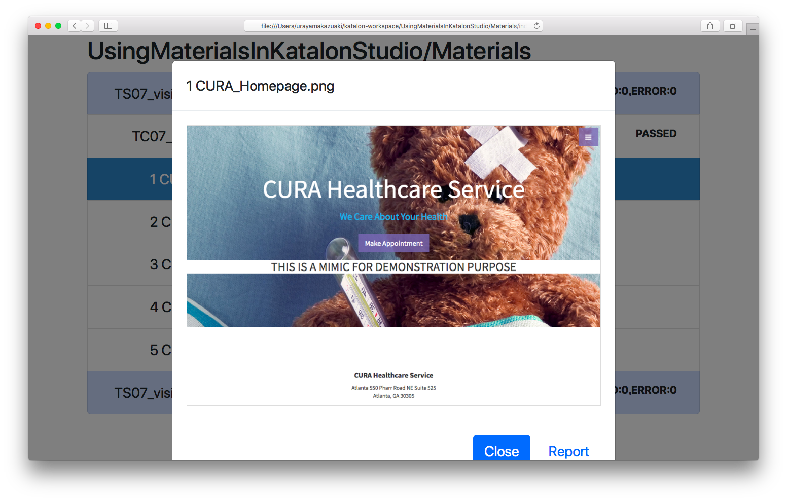
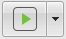

Using Materials in Katalon Studio
=====================================

# What is this repository?

This is a [Katalon Studio](https://www.katalon.com/) project for demonstration purpose. You can clone this out to your PC and run it with your Katalon Studio.

This project was developed using Katalon Studio 5.7.0.

I have developed another project on GitHub named ['Materials'](https://github.com/kazurayam/Materials). The project is developed in Groovy language, provides a jar file. The jar file Materials-x.x.jar is supposed to be imported into Katalon Studio projects as one of the [External library](https://docs.katalon.com/display/KD/External+Libraries).

In this 'UsingMaterialsInKatalonStudio' project, I will show you, step by step, how to write test scripts in Katalon Studio making use of the  ['Materials'](https://github.com/kazurayam/Materials) library.

# Problem to solve

What is a *material*? By the term *Material* I mean any file created on run by test scripts. A typical example of a *Material* is a screenshot image of a web page taken by [WebDriver API](https://seleniumhq.github.io/selenium/docs/api/java/org/openqa/selenium/TakesScreenshot.html). Other examples of *Material* include: PDF file downloaded from web site, Excel file created by test script, or XML/JSON response from RESTful API call.

Selenium WebDriver and Katalon Studio provide sound support for interacting with web. But their support falls short of the following  problem: **which path to save a file as?**

Specifying a one-off file path is trivial. Say, `C:\Users\myself\tmp\sample_screenshot.png` would be fine. However if we are to make dozens of *materials* repeatedly and **if we are to reuse the files after the tests**, then it becomes an itchy problem how to resolve paths for all *materials* appropriately. For example, I want to take 30 screenshots of my web app in both of the production environment and the development environment. After taking screenshots, I want to compare  pairs of images to find out if any difference found.

I need to design the paths for those files. I need a class library which implements a designed respository for the files (*materials*) with intuitive access methods.

# Solution

The [`Materials`](https://github.com/kazurayam/Materials) library provides the  `com.kazurayam.materials.MaterialRepository` class. A test script in Katalon Studio can let `MaterialRepository` to resolve path for a *material*. The path would be in the format as follows:

`${projectDir}/Materials/${testSuiteName}/${testSuiteTimestamp}/${testCaseName}/${subdirs}/${fileName}`

For example,

`./Materials/TS07_visit a web site/20180913_093512/TC07_visiting a web site/1 CURA_Homepage.png`

One of the examples here will output a file tree like this:


Also the `com.kazurayam.materials.MaterialRepository` class compiles `./Materials/index.html` file. This HTML file provides easy access to the files contained in the respository. The following picture shows an example of the index.



# How to set up

`${projectDir}/Drivers/Materials-0.17.jar` is already bundled in this demo project.

The ['Materials'](https://github.com/kazurayam/Materials) project does not yet have a public Maven Repository from which you can download distributable jar files. Wait for it for some time ...

You can clone the  ['Materials'](https://github.com/kazurayam/Materials) project onto your PC and build the project, provided that you have JDK 8 installed, by executing following command in commandline:

```
$ cd ${MaterialsProjectDir}
$ git checkout master
$ ./gradlew jar
```

You will find `Materials-x.x.jar` file in `${MaterialsProjectDir}/build/libs` directory. You can import the jar file into your Katalon Studio project as an [External library](https://docs.katalon.com/display/KD/External+Libraries).

# Description of codes

I will describe all test scripts one by one.

## Test Case `TC01_starter`

### source

The test case script is [here](Scripts/TC01_starter/Script1536633564054.groovy)

### description

This test case takes a screenshot of Web page `http://demoaut.katalon.com` and save the image into a file at  `${UsingMaterialsInKatalonStudio}/tmp/TC01_screenshot.png`.

### how to run it

You can run it as an usual test case in Katalon Studio:
1. select and open the test case `TC01_starter` in the Katalon Studio's Tests Explorer pane.
2. click the run button (a green arrow in the tool bar): 

### output

Running the test case will result in a file tree as follows:

```
$ cd UsingMaterialsInKatalonStudio/
$ tree tmp
tmp
└── TC01_screenshot.png
```

### notes

1. Following lines in `TC01_starter` shows that you have to explicitly specify the file path where to save the screenshot:
```
Path pngFile = tmpDir.resolve('TC01_screenshot.png')
WebUI.takeScreenshot(pngFile.toFile().toString())
```
1. The `TC01_starter` script does not depend on the `Materials` library at all. This test case is the starting point. From now on, we will modify the code step-by-step to make use of the `Materials` feature.
1. This test case newly creates a directory under the project directory like: `UsingMaterialsInKatalonStudio/tmp`.
1. Unfortunately Katalon Studio GUI does not allow you to view the added `tmp` directory. Instead you need to use other tools (Windows Explorer, Mac Finder, or Terminal, Emacs, vim, Atom, etc).
1. In the `TC01_starter` script, `java.nio.Path`, `java.nio.Paths` and `java.nio.Files` are used extensively. This is Java 8 way of dealing with file paths.


## Test Case `TC02_MaterialRepository`

### source
The test case script is  [here](Scripts/TC02_MaterialRepository/Script1536642272611.groovy).

Fragment:
```
import com.kazurayam.materials.MaterialRepository
import com.kazurayam.materials.MaterialRepositoryFactory
```
```
// descide in which directory we will create a MaterialRepository
Path materialsDir = Paths.get(RunConfiguration.getProjectDir()).resolve('Materials')

// create an instance of MaterialRepository
MaterialRepository mr = MaterialRepositoryFactory.createInstance(materialsDir)

// resolve the location of PNG file to save the screenshot
Path pngFile = mr.resolveMaterialPath('TC02_MaterialRepository', 'TC02_screenshot.png')
```

### description

This test case takes a screenshot of Web page `http://demoaut.katalon.com` and save the image into a file under the directory   `${UsingMaterialsInKatalonStudio}/Materials`. The file path is `Materials/_/_/TC02_MaterialRepository/TC02_screenshot.png`.

### how to run it

In Katalon Studio GUI, open the test case `TC02_MaterialRepository` and run it by clicking the run button


### output

Running this test case will result in the following tree:

```
$ tree Materials
Materials
└── _
    └── _
        └── TC02_MaterialRepository
            └── TC02_screenshot.png
```

### notes

1. `resolveMaterialPath(String testCaseName, String fileName)` resolves the path for a *material*. A File of length==0 will be created by this method call.

## Test Case `TC03_subdirectories under testCaseName`

### source

The test case script is
[here](Scripts/TC03_subdirectories under testCaseName/Script1536642359919.groovy).

Fragment:
```
Path pngFile = mr.resolveMaterialPath('TC03_subdirectories under testCaseName', 'subdirA/subdirA/TC03_screenshot.png')

```

### description

Please note that the 2nd argument to `resolveMaterialPath()` method call has prefix `subdirA/subdirB/`. You can create sub-directories under the testCaseName directory.

### how to run it

In Katalon Studio GUI, open the test case `TC03_subdirectories under testCaseName` and run it by clicking the run button  

### output

Running this test case will result in the following tree:

```
$ tree Materials
Materials
└── _
    └── _
        └── TC03_subdirectories under testCaseName
            ├── subdirA
            │   └── subdirA
            │       └── TC03_screenshot.png
            └── subdirB
                └── subdirB
                    └── TC03_screenshot.png
```

## Test Case `TC04_URL-based filename`

The test case script is
[here](Scripts/TC04_URL-based filename/Script1536642448370.groovy).

```
$ tree Materials
Materials
└── _
    └── _
        └── TC04_URL-based filename
            ├── http%3A%2F%2Fdemoaut.katalon.com.png
            └── subdir
                └── http%3A%2F%2Fdemoaut.katalon.com.png

```

## Test Case `TC05_GlobalVariable.CURRENT_TESTCASE_ID`

The test case script is  [here](Scripts/TC05_GlobalVariable.CURRENT_TESTCASE_ID/Script1536640253323.groovy).

```
:UsingMaterialsInKatalonStudio [master]$ tree Materials
Materials
└── _
    └── _
        └── TC05_GlobalVariable.CURRENT_TESTCASE_ID
            └── TC05_screenshot.png
```

## Test Case `TC06_GlobalVariable.MATERIAL_REPOSITORY`

The test case script is [here](Scripts/TC06_GlobalVariable.MATERIAL_REPOSITORY/Script1536640238920.groovy).

```
$ tree Materials
Materials
└── _
    └── _
        └── TC06_GlobalVariable.MATERIAL_REPOSITORY
            └── TC06_screenshot.png
```

## Test Suite `TS06_GlobalVariable.MATERIAL_REPOSITORY`

```

```

## Test Case `TS07_visit a web page`

The test case script is [here](Scripts/TC07_visiting a web site/Script1536650683310.groovy).

```
```


## Test Suite Collection `TSC09_visit a web site and make index`


The test case script is [here: TC08_makeIndex](Scripts/TC08_makeIndex/Script1536651022281.groovy).

## Test Suite Collection `TSC10_visit 2 environments`


