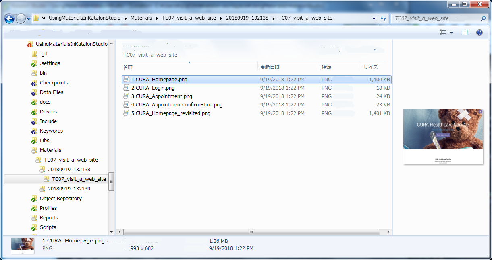
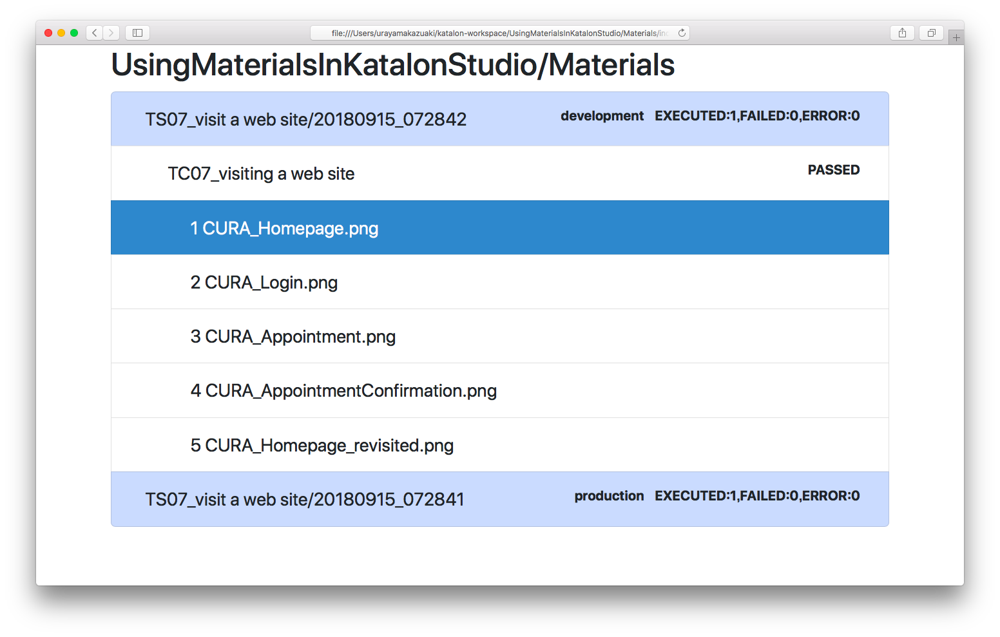

Using Materials in Katalon Studio
=====================================

# What is this repository?

This is a [Katalon Studio](https://www.katalon.com/) project for demonstration purpose. You can clone this out to your PC and run it with your Katalon Studio.

This project was developed using Katalon Studio 5.7.0.

I have developed another project on GitHub named ['Materials'](https://github.com/kazurayam/Materials). The project is developed in Groovy language, provides a jar file. The jar file Materials-x.x.jar is supposed to be imported into Katalon Studio projects as one of the [External library](https://docs.katalon.com/display/KD/External+Libraries).

In this 'UsingMaterialsInKatalonStudio' project, I will show you, step by step, how to write test scripts in Katalon Studio making use of the  ['Materials'](https://github.com/kazurayam/Materials) library.

The Groovydoc of the `Materials` is published [here](https://kazurayam.github.io/Materials/).

# Problem to solve

What is a *material*? By the term *Material* I mean any file created by test scripts on the fly. A typical example of a *Material* is a screenshot image of a web page taken by [WebDriver API](https://seleniumhq.github.io/selenium/docs/api/java/org/openqa/selenium/TakesScreenshot.html). Other examples of *Material* include: PDF file downloaded from web site, Excel file created by test script, or XML/JSON response from RESTful API call.

Selenium WebDriver and Katalon Studio provide sound support for interacting with web. But their support falls short of the following  problem: **which path to save a file as?**

Specifying a one-off file path is trivial. Say, `C:\Users\myname\tmp\sample_screenshot.png` would be fine. However if we are to make dozens of *materials* repeatedly and **if we are to reuse the files after interating with web**, then it becomes an itchy problem how to resolve paths for all *materials* appropriately.

How do I want to reuse materials? For example, I want to perform **Visual Testing** in Katalon Studio. I would take 30 screenshots of my web app in both of the production environment and the development environment. After taking screenshots, I want to compare  pairs of images to find out if any differences are found.

I need to design the paths for those files. Also I need a class library which implements a designed repository for the files (*materials*) with intuitive access methods.

# Solution

The [`Materials`](https://github.com/kazurayam/Materials) library implements the  `com.kazurayam.materials.MaterialRepository` object. A test script in Katalon Studio can ask the  `MaterialRepository` object to resolve path for a *material* for you. The path would be in the format as follows:

`${projectDir}/Materials/${testSuiteName}/${testSuiteTimestamp}/${testCaseName}/${subdirs}/${fileName}`

For example,

`./Materials/TS07_visit_a_web_site/20180919_132138/TC07_visit_a_web_site/1 CURA_Homepage.png`

One of the examples here will create a file tree like this:


Also the `com.kazurayam.materials.MaterialRepository` object can make `./Materials/index.html` file. This HTML file is a viewer, provides easy access to the files contained in the repository. The following picture shows an example of the `./Materials/index`.



# How to set up

`${projectDir}/Drivers/Materials-0.17.jar` is already bundled in this demo project.

The ['Materials'](https://github.com/kazurayam/Materials) project does not yet have a public Maven Repository from which you can download distributable jar files. Wait for it for some time ...

You can clone the  ['Materials'](https://github.com/kazurayam/Materials) project onto your PC and build the project, provided that you have JDK 8 installed, by executing following command in commandline:

```
$ cd ${MaterialsProjectDir}
$ git checkout master
$ ./gradlew jar
```

You will find `Materials-x.x.jar` file in `${MaterialsProjectDir}/build/libs` directory. You can import the jar file into your Katalon Studio project as an [External library](https://docs.katalon.com/display/KD/External+Libraries).

# Description of codes

I will describe all test scripts one by one. Please retrieve each pages by clicking the links.

## Test Cases

- [`TC01_starter`](./TC01_starter.md)
- [`TC02_MaterialRepository`](./TC02_MaterialRepository.md)
- [`TC03_subdirectories_under_testCaseName`](./TC03_subdirectories_under_testCaseName.md)
- [`TC04_URL-based_filename`](./TC04_URL-based_filename.md)
- [`TC05_GlobalVariable.CURRENT_TESTCASE_ID`](./TC05_GlobalVariable.CURRENT_TESTCASE_ID.md)

## Test Suites

- [`TS06_GlobalVariable.MATERIAL_REPOSITORY`](./TS06_GlobalVariable.MATERIAL_REPOSITORY.md)
- [`TS07_visit_a_web_site`](./TS07_visit_a_web_site.md)
- [`TS08_makeIndex`](./TS08_makeIndex.md)

## Test Suite Collections

- [`TSC09_visit_a_web_site_and_make_index`](./TSC09_visit_a_web_site_and_make_index.md)
- [`TSC10_visit_2_environments`](./TSC10_visit_2_environments.md)
