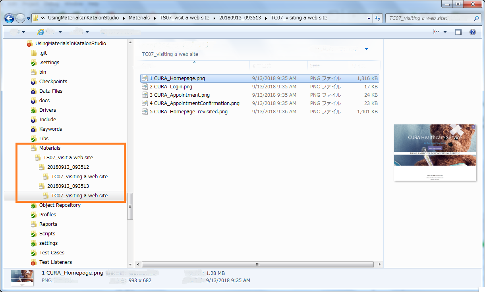
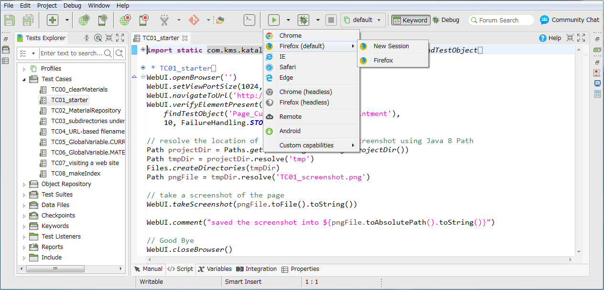
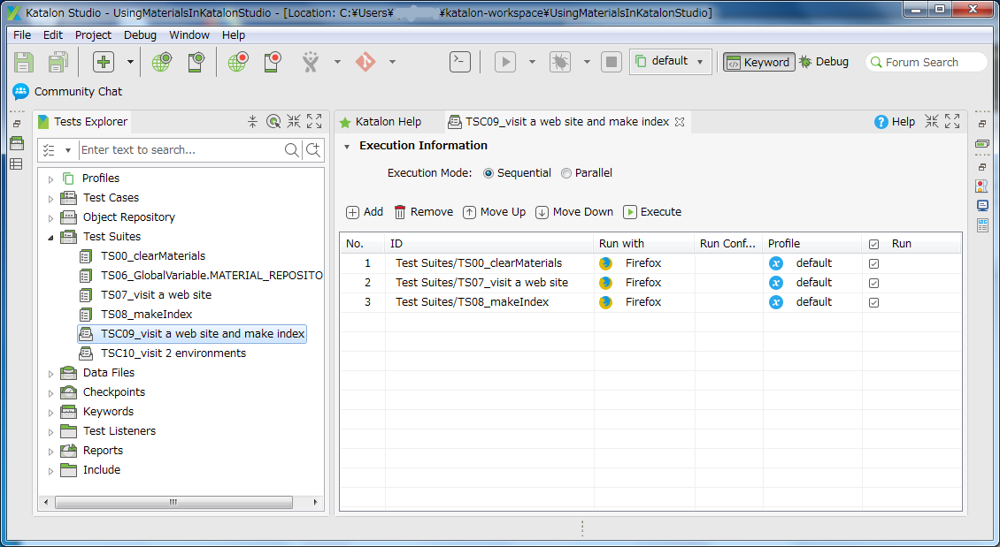

Using Materials in Katalon Studio
=====================================

# What is this repository?

This is a [Katalon Studio](https://www.katalon.com/) project for demonstration purpose. You can clone this out to your PC and run it with your Katalon Studio.

This project was developed using Katalon Studio 5.7.0.

In this 'UsingMaterialsInKatalonStudio' project, I will show you step by step how to code in Katalon Studio making use of the ['Materials'](https://github.com/kazurayam/Materials) library. The last of examples will output a file tree like this:



# Problem to solve

I have developed another project named ['Materials'](https://github.com/kazurayam/Materials). The Materials project is developed in Groovy language, provides a jar file. The jar file Materials-x.x.jar is supposed to be imported into a Katalon Studio project as one of the [External library](https://docs.katalon.com/display/KD/External+Libraries).

By the term *Material* I mean any file created by test scripts on the fly. A typical example of a *Material* is an image file which contains the screenshot of a Web page taken by a test case. Other examples of *Material* include other types of file: a PDF file downloaded from Web site, an Excel file created by test script on the fly, or a JSON response from REST-API call.

WebDriver API and Katalon Studio provide sound support for taking screenshots, downloading files, getting API response. But they fall short of a primitive problem: **which path to save a file as?**

Specifying a single file path is trivial. Say, 'C:\Users\me\tmp\screenshot.png' will be enough for one-time file. However if we are to make multiple *materials* repeatedly (10 times a day, for example) and if we are to review the *materials* after the test runs, then it becomes an itchy problem how to resolve appropriate paths for *materials*.

The `Materials` library is designed to solve this problem. A test script in Katalon Studio can resolve a path for a *material* in the following format:

`${projectDir}/Materials/${testSuiteName}/${testSuiteTimestamp}/${testCaseName}/${subdirs}/${fileName}`

For example,

`./Materials/TS07_visit a web site/20180913_093512/TC07_visiting a web site/1 CURA_Homepage.png`


# How to set up

`${projectDir}/Drivers/Materials-0.17.jar` is bundled in this project.

The ['Materials'](https://github.com/kazurayam/Materials) project does not have public Maven Repository from which you can download the distributable jar files. Wait for it for some time ...

You can clone the  ['Materials'](https://github.com/kazurayam/Materials) project onto your PC and build the project by executing following command in commandline:

```
$ cd materials
$ git checkout master
$ ./gradlew jar
```

You will find `Materials-x.x.jar` file in `${MaterialsProjectDir}/build/libs` directory. You can import the jar file into your Katalon Studio project as an [External library](https://docs.katalon.com/display/KD/External+Libraries).

# Description of codes

I will describe all test scripts one by one.

## Test Case `TC01_starter`

### Source

The test case script is [here](Scripts/TC01_starter/Script1536633564054.groovy)

### Description

This test case takes a screenshot of Web page `http://demoaut.katalon.com` and save the image into a file at  `${projectDir}/tmp/TC01_screenshot.png`.

### How to run it

You can run it in Katalon Studio:
1. select and open the test case `TC01_starter` in the Katalon Studio's Test Explorer pane.
2. click the run button (a green arrow in the tool bar): 

### Output

Running the test case will result in a file tree as follows:

```
$ cd UsingMaterialsInKatalonStudio/
$ tree tmp
tmp
└── TC01_screenshot.png
```

### Note

- The `TC01_starter` shows that you have to explicitly specify the file path where to save the screenshot.
- The `TC01_starter` script does not depend on the `Materials` library at all. This test case is the starting point. From now on, we will modify the code step-by-step to make use of the `Materials` feature.
- This test case newly creates a directory under under the project directory: `UsingMaterialsInKatalonStudio/tmp`. Unfortunately Katalon Studio GUI does not allow you to view the `tmp` directory. Instead you need to use other tools (Windows Explorer, Mac Finder, or Terminal, Emacs, vim, Atom, etc).
- In the `TC01_starter` script, `java.nio.Path`, `java.nio.Paths` and `java.nio.Files` are used extensively.


## Test Case `TC02_MaterialRepository`

The test case script is  [here](Scripts/TC02_MaterialRepository/Script1536642272611.groovy).

Running this test case will result in the following tree:
```
$ tree Materials
Materials
└── _
    └── _
        └── TC02_MaterialRepository
            └── TC02_screenshot.png
```

## Test Case `TC03_subdirectories under testCaseName`

The test case script is
[here](Scripts/TC03_subdirectories under testCaseName/Script1536642359919.groovy).


```
$ tree Materials
Materials
└── _
    └── _
        └── TC03_subdirectories under testCaseName
            ├── subdirA
            │   └── subdirA
            │       └── TC03_screenshot.png
            └── subdirB
                └── subdirB
                    └── TC03_screenshot.png
```

## Test Case `TC04_URL-based filename`

The test case script is
[here](Scripts/TC04_URL-based filename/Script1536642448370.groovy).

```
$ tree Materials
Materials
└── _
    └── _
        └── TC04_URL-based filename
            ├── http%3A%2F%2Fdemoaut.katalon.com.png
            └── subdir
                └── http%3A%2F%2Fdemoaut.katalon.com.png

```

## Test Case `TC05_GlobalVariable.CURRENT_TESTCASE_ID`

The test case script is  [here](Scripts/TC05_GlobalVariable.CURRENT_TESTCASE_ID/Script1536640253323.groovy).

```
:UsingMaterialsInKatalonStudio [master]$ tree Materials
Materials
└── _
    └── _
        └── TC05_GlobalVariable.CURRENT_TESTCASE_ID
            └── TC05_screenshot.png
```

## Test Case `TC06_GlobalVariable.MATERIAL_REPOSITORY`

The test case script is [here](Scripts/TC06_GlobalVariable.MATERIAL_REPOSITORY/Script1536640238920.groovy).

```
$ tree Materials
Materials
└── _
    └── _
        └── TC06_GlobalVariable.MATERIAL_REPOSITORY
            └── TC06_screenshot.png
```

## Test Case `TC07_visiting a web page`

The test case script is [here](Scripts/TC07_visiting a web site/Script1536650683310.groovy).

```
$ tree Materials
Materials
└── _
    └── _
        └── TC07_visiting a web site
            ├── CURA_Appointment.png
            ├── CURA_AppointmentConfirmation.png
            ├── CURA_Homepage.png
            ├── CURA_Homepage_revisited.png
            └── CURA_Login.png
```

## Test Case `TC08_makeIndex`

The test case script is [here](Scripts/TC08_makeIndex/Script1536651022281.groovy).

```
$ tree Materials
Materials
├── _
│   └── _
│       └── TC08_makeIndex
│           ├── CURA_Appointment.png
│           ├── CURA_AppointmentConfirmation.png
│           ├── CURA_Homepage.png
│           ├── CURA_Homepage_revisited.png
│           └── CURA_Login.png
└── index.html

```


## Test Suite Collection `TSC09_visit a web site and make index`




## Test Suite Collection `TSC10_visit 2 environments`


