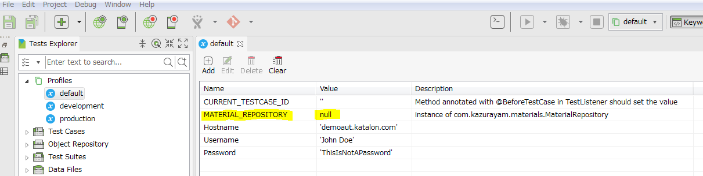
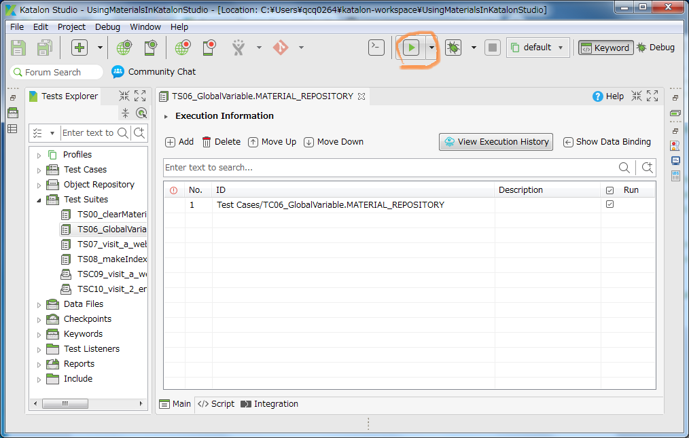
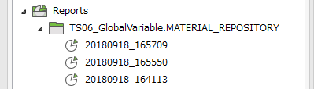

## Test Suite `TS06_GlobalVariable.MATERIAL_REPOSITORY`

In the `TC05_GlobalVariable.CURRENT_TESTCASE_ID` we executed individual Test Cases. From this point, we will wrap each test cases with test suite, and will execute the test suite. Why we do so? What is the benefit of using Test Suites? --- I will explain later.

### source

Here we introduce a GlobalVariable named `MATERIAL_REPOSITORY`.


Please make sure that the `MATERIAL_REPOSITORY` is initialized with value of `null`. The Value of `null` here means that the `MATERIAL_REPOSITORY` variable is declared as an instance of `java.lang.Object`. The `MATERIAL_REPOSITORY` must not be declared as other types such as `String`.

In the Test Listener [`Test Listeners/MyTestListener.groovy`](Test%20Listeners/MyTestListener.groovy) we create an instance of `com.kazurayam.materials.Material` and store it into the GlobalVariable.

In the method annotated with `@BeforeTestSuite` we do this:
```
@BeforeTestSuite
def beforeTestSuite(TestSuiteContext testSuiteContext) {
    // prepare instance of MaterialRepository
    // The directory 'Materials' will be created if not present by the MaterialRepository
    MaterialRepository mr = MaterialRepositoryFactory.createInstance(materialsDir)

    // Find out the Test Suite ID
    String testSuiteId = testSuiteContext.getTestSuiteId()

    // Find out the Test Suite Timestamp
    Path reportDir = Paths.get(RunConfiguration.getReportFolder())
    String testSuiteTimestamp = reportDir.getFileName().toString()
    // e.g. '20180618_165141'

    // inform the MaterialRespository of the current Test Suite
    mr.putCurrentTestSuite(testSuiteId, testSuiteTimestamp)

    // save the instance into GlobalVariable so that it is visible
    // for all test cases activated by the Test Suite
    GlobalVariable.MATERIAL_REPOSITORY = mr
```

The following line may look magical:
```
mr.putCurrentTestSuite(testSuiteId, testSuiteTimestamp)
```
I will explain what it does in the 'output' section.


Also in the method annotated with `@BeforeTestCase` we do this:
```
@BeforeTestCase
def beforeTestCase(TestCaseContext testCaseContext) {
    ...
    // prepare an instance of MaterialRepository
    // The directory 'Materials' will be created if not present by the MaterialRepository
    // This is necessary for the case a Test Case is executed directly without being wrapped by a Test Suite.
    if (GlobalVariable.MATERIAL_REPOSITORY == null) {
        // If wrapped by a Test Suite, the handler method annotated with @BeforeTest suite will be called
        // and it will instantiate a MaterialRepository and store it into GlobalVariable. Therefore
        // we check if the GlobalVariable is null or not. We will instantiate new one
        // only when the GlobalVariable is null.
        MaterialRepository mr = MaterialRepositoryFactory.createInstance(materialsDir)
        GlobalVariable.MATERIAL_REPOSITORY = mr
    }
}
```

Now the Test case [`TC06_GlobalVariable.MATERIAL_REPOSITORY`](Scripts/TC06_GlobalVariable.MATERIAL_REPOSITORY/Script1536640238920.groovy) refers to the `GlobalVariable.MATERIAL_REPOSITORY` like this:
```
MaterialRepository mr = (MaterialRepository)GlobalVariable.MATERIAL_REPOSITORY
assert mr != null
...
Path pngFile = mr.resolveMaterialPath(testCaseId, 'TC06_screenshot.png')

```

The [`TC06_GlobalVariable.MATERIAL_REPOSITORy`](Scripts/TC06_GlobalVariable.MATERIAL_REPOSITORY/Script1536640238920.groovy), [`TC07_visiting_a_web_site`](Scripts/TC07_visiting_a_web_site/Script1537147387325.groovy) and [`TC08_makeIndex`](Scripts/TC08_makeIndex/Script1536651022281.groovy) --- these test cases do not instantiate the `com.kazurayam.materials.MaterialRepository`. Instead, the `Test Listener/MyTestListener` now holds centralized control over instantiating
the `com.kazurayam.materials.MaterialRepository` object.

### how to run it

You can run it as an usual test suite in Katalon Studio:

1. select and open the test suite `TS06_GlobalVariable.MATERIAL_REPOSITORY` in the Katalon Studio's Tests Explorer pane.
2. click the run button (a green arrow in the tool bar):


### output

Running the test suite `TS06_GlobalVariable.MATERIAL_REPOSITORY` will result in the following tree.

```
$ cd UsingMaterialsInKatalonStudio
$ tree Materials
Materials
└─TS06_GlobalVariable.MATERIAL_REPOSITORY
    └─20180918_164113
        └─TC06_GlobalVariable.MATERIAL_REPOSITORY
                TC06_screenshot.png
```

Please note the directory name **`TS06_GlobalVariable.MATERIAL_REPOSITORY`** and **`20180918_164113`**. The name of Test Suite, and the timestamp when the Test Suite was executed. The timestamp value `yyyyMMdd_hhmmss` will be different time to time.

How the timestamp value was identified? --- The  `com.kazurayam.materials.MaterialRepository` object was informed of these by the method annotated with `@BeforeTestSuite` in the `MyTestLister`:
```
    mr.putCurrentTestSuite(testSuiteId, testSuiteTimestamp)
```

*Having a redundant directory layer with timestamp is useful because it enables us to retain all the materials created by previous test suite runs chronologically. This enables us to reuse the materials created by previous test suite runs*.

I imitated the directory structure of the `Reports` directory of Katalon Studio.


