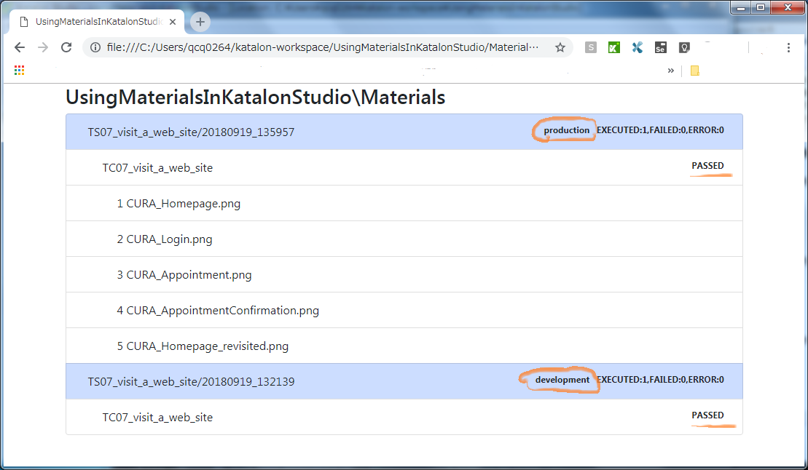
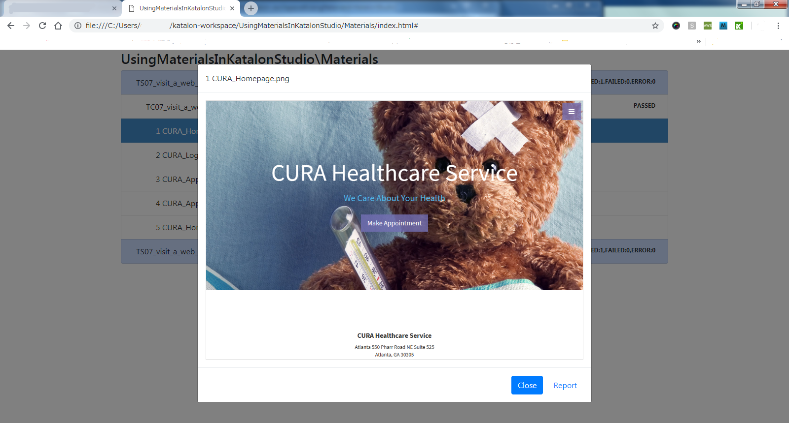

## Test Case `TS08_makeIndex`

### source

The test case script `TC08_makeIndex` is [here](Scripts/TC08_makeIndex/Script1536651022281.groovy).
This test case makes just a single method call `MaterialRepository#makeIndex()`.

```
MaterialRepository mr = (MaterialRepository)GlobalVariable.MATERIAL_REPOSITORY

// make ./Material/index.html file
mr.makeIndex()
```

### output

`MaterialRepository.makeIndex()' makes a HTML file `<project dir>/Materials/index.html`

```
$ cd UsingMaterialsInKatalonStudio
$ tree Materials
Materials
│  index.html
│  
└─TS07_visit_a_web_site
    ├─20180919_132139
    │  └─TC07_visit_a_web_site
    │          1 CURA_Homepage.png
    │          2 CURA_Login.png
    │          3 CURA_Appointment.png
    │          4 CURA_AppointmentConfirmation.png
    │          5 CURA_Homepage_revisited.png
    │          
    └─20180919_135957
        └─TC07_visit_a_web_site
                1 CURA_Homepage.png
                2 CURA_Login.png
                3 CURA_Appointment.png
                4 CURA_AppointmentConfirmation.png
                5 CURA_Homepage_revisited.png
```

You can open the index.html in your web browser. It will give you tree-like view as follows:


In the above screenshot you can find `production` and `development` in the bar of test suites. This is the name of Execution Profiles which were applied to the Test Suite run.

In the above screenshot you can also find `PASSED` or `FAILURE` for each test case results. This is, as you expect, the result of each test case run.

You can open each material in modal window as follows:

