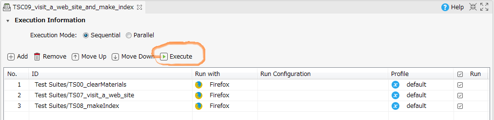
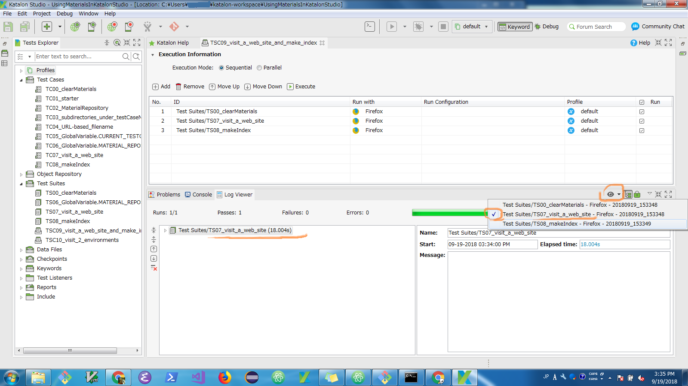

## Test Suite Collection `TSC09_visit_a_web_site_and_make_index`

### description

Now we make a Test Suite Collection named `TSC09_visit_a_web_site_and_make_index`.

This Test Suite Collection executes 3 test suites sequentially:

1. `TS00_clearMaterials`
2. `TS07_visit_a_web_site`
3. `TS08_makeIndex`

### how to execute it

In the Test Suite Collection pane, you can find a green button labeled `Execute`

Click this button, then the test suite collection will start running.

### how to retrieve the logs in Test Suite Collection

A Test Suite Collection consists of multiple Test Suites. Once you execute it, you will want to view all the logs emitted by test suites. However Katalon Studio GUI is a bit blunt and you are likely to wonder how you can view the logs.

There is an *eye icon* in the Test Suite Collection pane. See the following screenshot. By clicking the eye icon you will find a list of test suite logs where you can choose one to retrieve.

