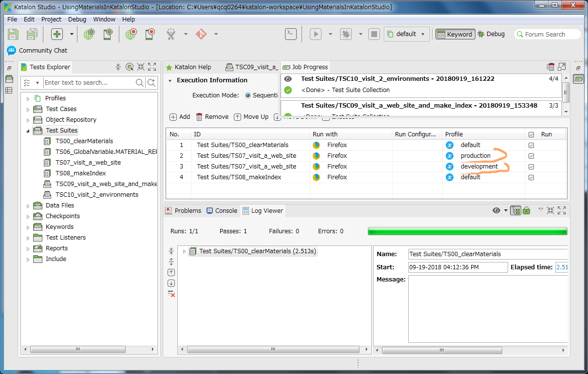
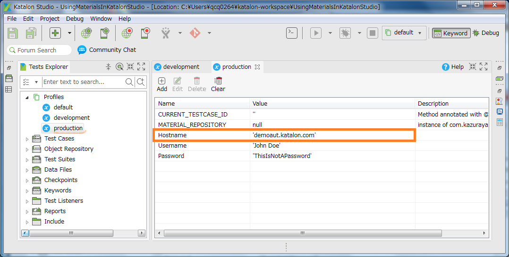
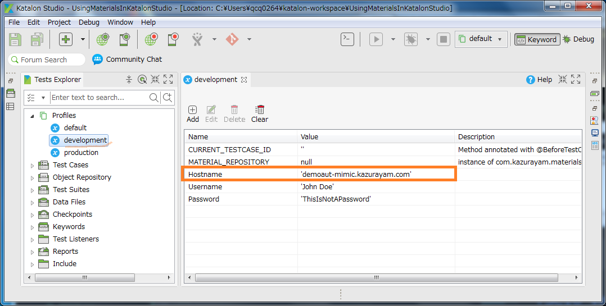
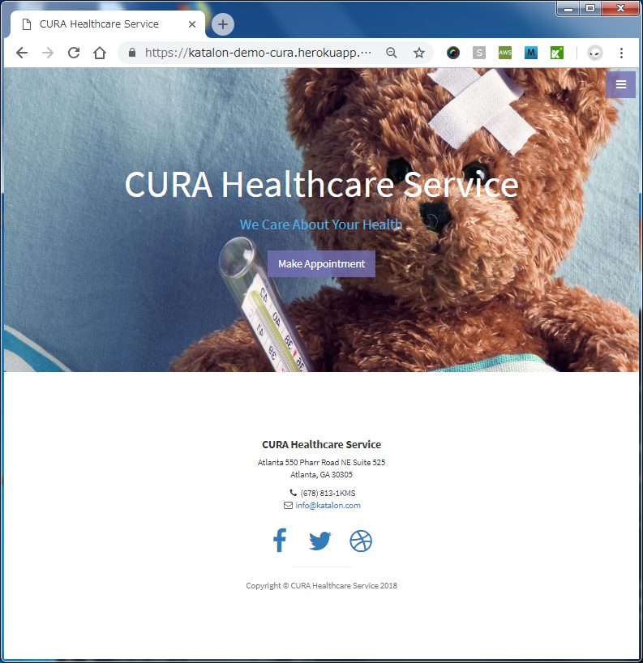
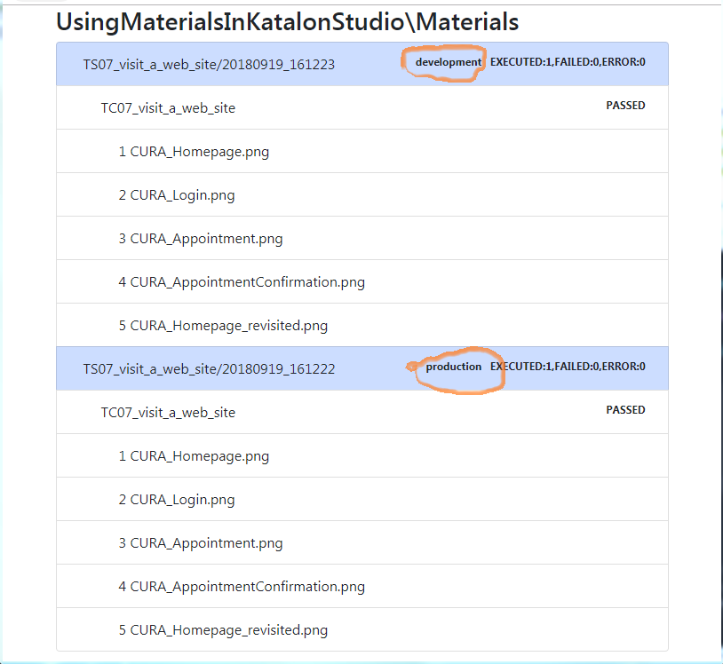

## Test Suite Collection `TSC10_visit_2 environments`

### description

The test suite collection `TSC10_visit_2_environments` executes test suite `TS07_visit_a_web_site` twice.
Once with Profile named `production`, and one more time with Profile named `development`.

This test suite collection makes 2 sets of screenshots immediately after another. One is screenshots of the production environment, and another is screenshots of the development environment.

### 2 environments --- production, development

The Profile `production` contains `GlobalVariable.Hostname=demoaut.katalon.com`

And the profile `development` contains `GlobalVariable.Hostname=demaut-mimic.kazurayam.com`

Here I would call http://demoaut.katalon.com/ as *production* environment. And I would call http://demoaut-mimic.kazurayam.com/ as *development* environment.

| Production | Development |
|:-----------|:------------|
| http://demoaut.katalon.com/   | http://demoaut-mimic.kazurayam.com/  |

You can easily see the development environment is slightly different from the production.

### output

The test suite collection `TSC10_visit_2_environments` create `./Materials/index.html` as follows:

Please note that each `TS07_visit_a_web_site` nodes are labeled with Execution Profile name: `development` and `production`.

### Note

<blockquote>I made the mimic page http://demoaut-mimic.kazurayam.com/ by slightly modifying the original http://demoaut.katalon.com/. I hope Katalon Team gently allow me to use the mimic page. I hope I am allowed to use it solely for demonstration purpose.</blockquote>
