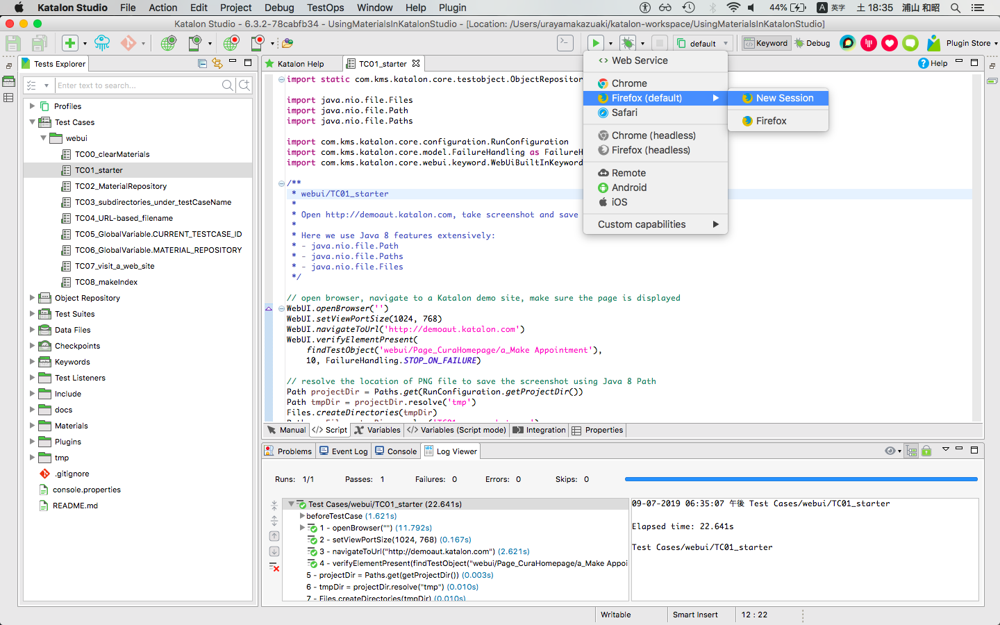

## Test Case `webui/TC01_starter`

### source

The test case script is [here](../../Scripts/webui/TC01_starter/Script1536633564054.groovy)

### description

This test case takes a screenshot of Web page `http://demoaut.katalon.com` and save the image into a file at  `${UsingMaterialsInKatalonStudio}/tmp/TC01_screenshot.png`.

### how to run it

You can run it as an usual test case in Katalon Studio:
1. select and open the test case `TC01_starter` in the Katalon Studio's Tests Explorer pane.
2. click the run button (a green arrow in the tool bar): 

### output

Running the test case will result in a file tree as follows:

```
$ cd UsingMaterialsInKatalonStudio/
$ tree tmp
tmp
└── TC01_screenshot.png
```

### notes

1. Following lines in `TC01_starter` shows that you have to explicitly specify the file path where to save the screenshot:
```
Path pngFile = tmpDir.resolve('TC01_screenshot.png')
WebUI.takeScreenshot(pngFile.toFile().toString())
```
1. The `webui/TC01_starter` script does not depend on the `Materials` library at all. This test case is the starting point. From now on, we will write new scripts slightly modifying previous example. The modifications will show how to make use of the `Materials` feature step by step.
1. The test case `webui/TC01_starter` newly creates a directory under the project directory like: `UsingMaterialsInKatalonStudio/tmp`.
1. Katalon Studio GUI does not allow you to view the added `tmp` directory in its GUI. Instead you need to use other tools (Windows Explorer, Mac Finder, or Terminal, Emacs, vim, Atom, etc) to see the `tmp` contents.
1. In the `TC01_starter` script, `java.nio.Path`, `java.nio.Paths` and `java.nio.Files` are used extensively. This is Java 8 way of dealing with file paths.
